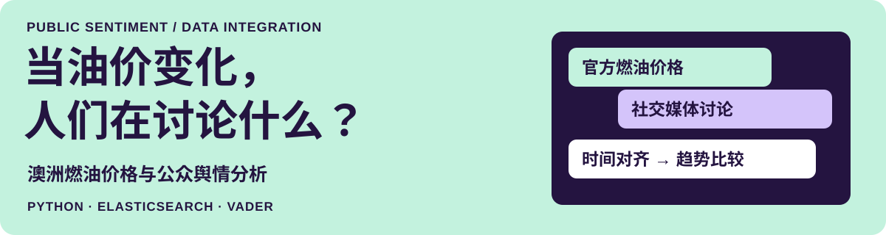

### 你好，我是陈澄。用 SQL、Python 和 BI，把业务问题拆开看。

墨尔本大学 **数据科学硕士在读**，正在寻找 **数据分析实习**。关注电商经营、用户行为与业务效率，也喜欢把重复的数据工作变成可复用的工具。

<a href="#精选项目">精选项目</a> &nbsp; / &nbsp; <a href="#实习经历">实习经历</a> &nbsp; / &nbsp; <a href="#工具与方法">工具与方法</a> &nbsp; / &nbsp; <a href="#教育背景">教育背景</a>

## 精选项目

### 澳洲燃油价格与公众舆情分析

**从价格走势到公众反应。** 将官方燃油价格与社交媒体讨论按时间对齐，支持情感、主题和讨论热度的对照分析。

`Python` `Elasticsearch` `VADER` `多源数据整合`

<strong>查看我的贡献与分析流程</strong>

- **统一检索：** 设计 Elasticsearch 索引、字段映射、文档 ID 规则和聚合查询，支持 BlueSky、GDELT 与官方燃油价格数据的统一检索。
- **时间对齐：** 处理并验证官方价格数据，按时间维度对齐周度价格与社交媒体讨论。
- **文本分析：** 基于 VADER 与主题标签开展情感评分、主题识别和热度统计，为趋势比较提供数据与分析结果。

 

### Lending Club 信贷违约预测与特征工程评估

**复杂特征能否改善未来周期的预测？** 基于 **125,000 条贷款样本**，对比特征工程方案与模型，重视数据泄露防控和跨时间验证。

`Python` `Pandas` `LightGBM` `scikit-learn` `Bootstrap`

<strong>查看数据处理、建模与评估</strong>

- **数据处理：** 剔除贷后泄露字段，完成 CPI 通胀调整、缺失值填补与类别变量编码。
- **特征与模型：** 构建金融压力、还款能力、信用历史、宏观经济和时间标准化特征，对比 Logistic Regression、LightGBM 和 NODE。
- **验证方式：** 采用 Expanding-window validation 与 Bootstrap，对比 AUC、F1、Precision 和 Recall；项目评估显示 LightGBM 在该数据上的表现更稳定。

## 实习经历

<strong>Apple · 数据分析｜查看贡献</strong>

**数据分析 · 大中华区销售部**  
2026.06–2026.09 / 2026.01–2026.04

<strong>线上渠道｜经营诊断与预算规划</strong> 整合销售、财务、广告与库存数据，统一日期和商品口径；从需求、转化、利润、库存与竞争维度开展诊断，并通过模型解释与时间序列验证支持判断。

分析 MDF 计划与执行偏差，开发 Excel 校验、报表及预算规划工具，支持业务人员审核建议后执行。

<strong>多门店渠道｜门店分析与流程自动化</strong> 基于人流与转化率开展 K-means 聚类和指标下钻，使用 Tableau 分析销售变化；将返利计算整理为标准化流程，并通过 LLM 识图把 PDF 产品信息转为结构化 Excel 数据。

<code>经营分析</code> <code>Tableau</code> <code>预测验证</code> <code>自动化</code>

<strong>得物 · 商家运营｜查看贡献</strong>

**商家运营 · 国际事业部**  
2025.12–2026.01

支持商家运营流程，跟踪 GMV 与目标完成进度，针对未达标情况开展原因分析和专题复盘。

<code>GMV 分析</code> <code>目标跟踪</code> <code>业务复盘</code>

<strong>SHEIN · 数据分析｜查看贡献</strong>

**数据分析 · 研发效能架构部**  
2024.10–2025.02

使用 SQL 支持跨部门取数，搭建平台使用情况看板，分析用户信息、使用时长和频率。

校验 FCP、LCP、UV、PV 等埋点指标，排查异常；协同产品团队完善分析筛选、关键指标和导出能力，支持自助分析。

<code>SQL</code> <code>用户行为</code> <code>埋点校验</code> <code>BI 看板</code>

<strong>贝卡尔特 · 数据分析｜查看贡献</strong>

**数据分析 · 实验室**  
2023.07–2023.08

使用 Microsoft Access 清洗设备数据，通过 Power BI 排查运行异常；使用 HTML、Python、CSS 开发 Web 日报系统，支持生产监控与信息共享。

<code>数据清洗</code> <code>Power BI</code> <code>异常分析</code>

## 工具与方法

| 数据处理与呈现 | 分析建模与验证 |
| :--- | :--- |
| SQL、Python（Pandas / NumPy）、Excel | 回归、聚类、特征工程 |
| Tableau、Power BI、Elasticsearch | LightGBM、CatBoost / SHAP、scikit-learn |
| 指标体系、经营分析、用户行为分析 | 时间序列交叉验证、Expanding-window validation、Bootstrap |

## 教育背景

🎓 **墨尔本大学｜数据科学硕士（在读）**  
2025.03–2026.12

🎓 **曼尼托巴大学｜数学与经济学双学士**  
2019.01–2024.06

电商经营 · 用户行为 · 业务效率 &nbsp; / &nbsp; <a href="https://www.linkedin.com/in/cheng-chen-work">LinkedIn ↗</a>

